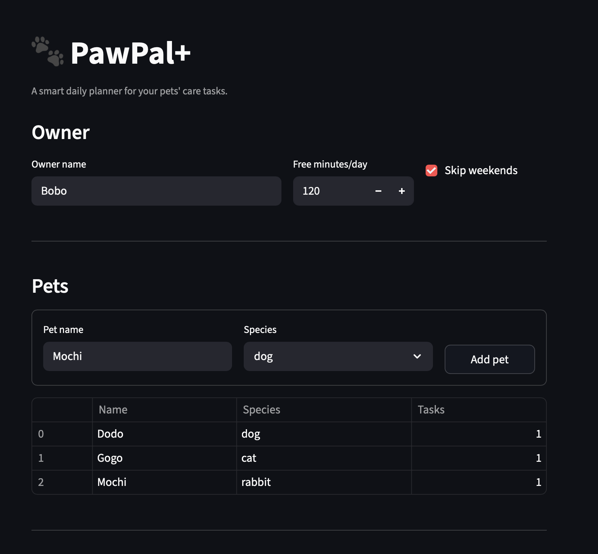
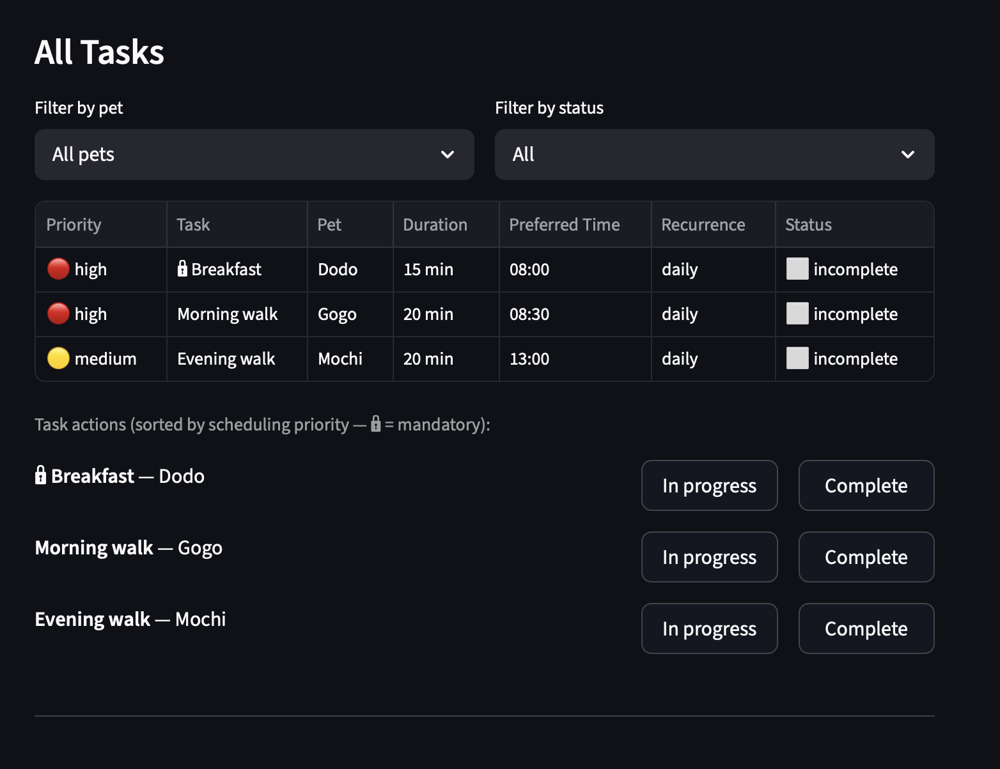
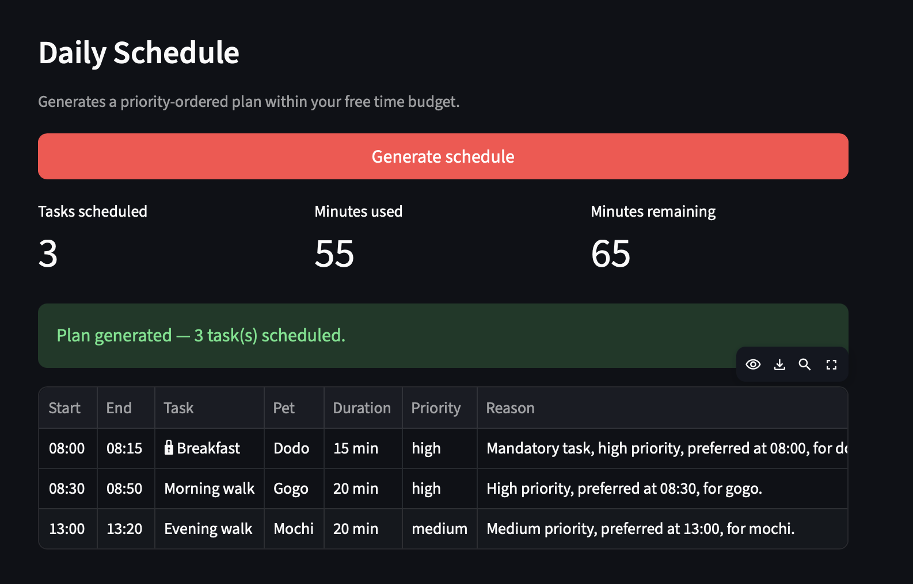

# PawPal+ (Module 2 Project)

You are building **PawPal+**, a Streamlit app that helps a pet owner plan care tasks for their pet.

## Scenario

A busy pet owner needs help staying consistent with pet care. They want an assistant that can:

- Track pet care tasks (walks, feeding, meds, enrichment, grooming, etc.)
- Consider constraints (time available, priority, owner preferences)
- Produce a daily plan and explain why it chose that plan

Your job is to design the system first (UML), then implement the logic in Python, then connect it to the Streamlit UI.

## What you will build

Your final app should:

- Let a user enter basic owner + pet info
- Let a user add/edit tasks (duration + priority at minimum)
- Generate a daily schedule/plan based on constraints and priorities
- Display the plan clearly (and ideally explain the reasoning)
- Include tests for the most important scheduling behaviors

## Smarter Scheduling

The scheduler goes beyond a simple priority queue. Here is what it does:

**Preferred-time placement** — each task has an optional `preferred_time` (HH:MM). The scheduler idles forward to that slot if the day hasn't reached it yet, so tasks land when the owner actually wants to do them.

**Inter-task buffers** — a 5-minute gap is automatically inserted between consecutive tasks. When the scheduler idles forward to a preferred time, the buffer is absorbed into that gap so no extra time is wasted.

**Priority-ordered sorting** — tasks are sorted by `(mandatory status, priority level, preferred_time, duration)`. Mandatory tasks always schedule before optional ones; within each group, earlier preferred times come first.

**Pet fairness** — optional tasks are round-robin interleaved across pets after mandatory tasks are placed, so no single pet monopolises the remaining time budget.

**Bin-packing second pass** — after the main loop, any tasks that were too long to fit are retried shortest-first against the leftover budget, filling gaps that the greedy pass missed.

**Urgency decay** — if a task is skipped due to the time budget, its `last_skipped` date is recorded. Each day it goes unscheduled, its priority rank improves by 1 (floored at 1), so repeatedly deferred tasks gradually bubble up.

**Recurrence** — tasks can be marked `"daily"` or `"weekly"`. When `mark_complete()` is called on a recurring task, a fresh copy is automatically added back to the pet so it reappears in the next plan.

**Conflict detection** — before scheduling begins, the scheduler scans for tasks that share the same `preferred_time` and emits a warning listing which tasks are competing. During scheduling, any task that misses its preferred slot due to earlier overruns is also flagged. All warnings are non-fatal and stored on `DailyPlanner.warnings`.

**Skip weekends** — an owner preference (`skip_weekends: True`) causes the scheduler to return an empty plan on Saturdays and Sundays without touching mandatory tasks.

**Filtering** — `Owner.filter_tasks(status, pet_name)` and `Pet.filter_tasks(status)` let you query tasks by completion status, pet, or both without iterating manually.

## Testing PawPal+

### Running the tests

```bash
python -m pytest tests/test_pawpal.py -v
```

### What the tests cover

The test suite contains **10 tests** across three areas:

| Area | Tests | What is verified |
|------|-------|-----------------|
| **Sorting correctness** | 3 | Tasks sort chronologically by `preferred_time`; tasks without a preferred time land last; mandatory tasks always precede optional ones regardless of priority label |
| **Recurrence logic** | 3 | Completing a `daily` task spawns exactly one fresh `incomplete` copy with a clean `last_skipped`; non-recurring tasks do not spawn copies; recurring tasks with no pet assigned complete without crashing |
| **Conflict detection** | 2 | Two tasks sharing a `preferred_time` produce a warning in `DailyPlanner.warnings`; tasks with distinct preferred times produce no conflict warnings |
| **Core lifecycle** | 2 | `mark_complete()` transitions status to `"complete"`; `add_task()` correctly grows the pet's task list |

### Confidence Level

**4 / 5 stars**

The core scheduling behaviors — sorting, recurrence, and conflict detection — are fully exercised and all 10 tests pass. One star is held back because the bin-packing second pass, urgency decay, and the `skip_weekends` preference are not yet covered by tests; edge cases in those areas could still hide bugs.

## Getting started

### Setup

```bash
python -m venv .venv
source .venv/bin/activate  # Windows: .venv\Scripts\activate
pip install -r requirements.txt
```

### Suggested workflow

1. Read the scenario carefully and identify requirements and edge cases.
2. Draft a UML diagram (classes, attributes, methods, relationships).
3. Convert UML into Python class stubs (no logic yet).
4. Implement scheduling logic in small increments.
5. Add tests to verify key behaviors.
6. Connect your logic to the Streamlit UI in `app.py`.
7. Refine UML so it matches what you actually built.

### Demo



